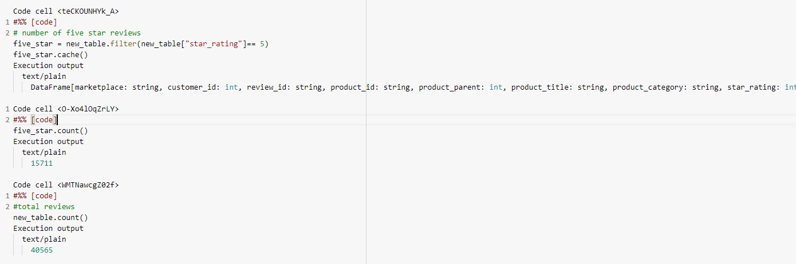
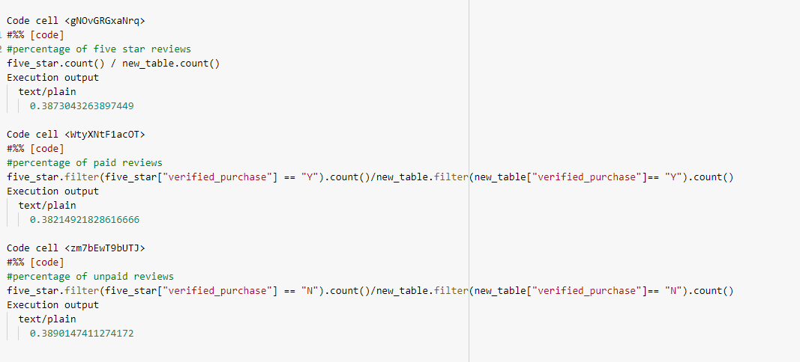

# Amazon_Vine_Analysis

## Overview of the analysis:
- The purpose of this challenge is to pick a dataset from the 50 different types
 in the Amazon Vine Program and extract the dataset and transform it through a 
 AWS instance. Next, you’ll use PySpark, Pandas, or SQL to determine if there is 
 any bias toward favorable reviews from Vine members in your dataset.
	

## Results: 

## How many Vine reviews and non-Vine reviews were there?
- There were a total of of 4,291 vine reviews in our dataset, and 40,471 non-vine reviews in the complete dataset.

## How many Vine reviews were 5 stars? How many non-Vine reviews were 5 stars?

- In the data set their was a total of 15,711 5-star reviews
- 15,663 of the 5-star reviews were non-vine

## What percentage of Vine reviews were 5 stars? What percentage of non-Vine reviews were 5 stars?

- 38.2% of the five_star reviews were vine
- 38.9% of the five_star reviews were non-vine

## Summary: 
- There does not appear to be any sort of positivity bias because the percentages shown above are very similar at 38%. 
- The vine program does not show any bias.
